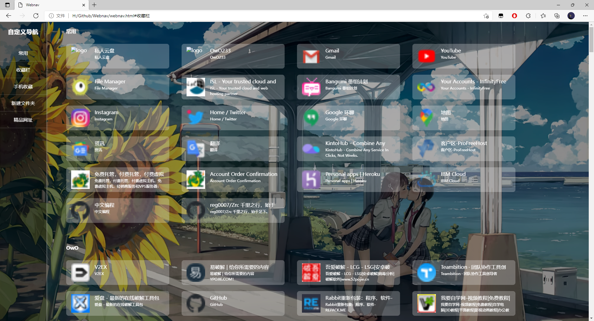

### 注：JQuery练手，纯属一乐

#### 功能

将谷歌浏览器导出的`HTML`格式书签转为`JSON`格式作为数据源生成自定义的导航网站

#### 说明

- 转换后的json数据保存在线上（如七牛云）通过`ajax`获取
- 本代码利用~~逐渐被淘汰的~~`jQuery`读取筛选数据并生成`HTML`单页面

demo书签来源于(随机挑选）：[书签地球](https://www.bookmarkearth.com/detail/f792924da50440a884e2cd8339a4dcc8 )

书签格式转换参考（懒得改）：[处理谷歌浏览器导出书签为json格式](https://www.jianshu.com/p/45677cd1a752)

背景图片来自于网络：色气 + 可爱

#### 预览

